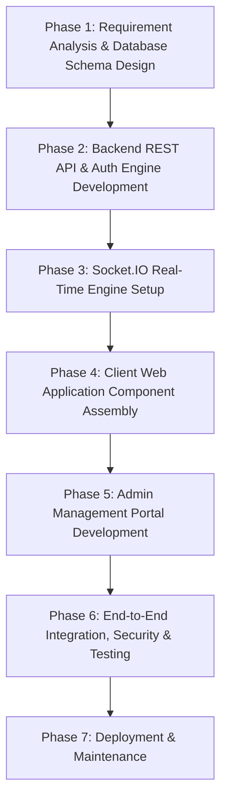

# CampusRoots - Project Synopsis, Proposal & Academic Documentation 🎓

---

## 1. Project Title

**CampusRoots: An Exclusive Domain-Locked Institutional Alumni Networking & Career Mentorship Platform for CHARUSAT**

---

## 2. Domain of Project Definition

* **Primary Domain**: Web Application Engineering / Full-Stack Software Development
* **Secondary Sub-Domains**:
  * Social Networking Systems & Digital Community Platforms
  * Real-Time Event-Driven Communication (WebSockets)
  * Educational Technology (EdTech) & Institutional Mentorship Systems
  * Content Moderation & Role-Based Access Control (RBAC) Security

---

## 3. Project Objectives and Scope

### 🎯 3.1 Project Objectives (Specific & Measurable Goals)
1. **Verified Institutional Access**: Implement strict domain-locked authentication allowing only valid `@charusat.edu.in` and `@charusat.ac.in` email holders via Google OAuth 2.0 and Email OTP to eliminate unverified external accounts.
2. **Centralized Talent & Alumni Directory**: Build a search engine capable of filtering thousands of alumni and student profiles by department, graduation batch, employer, designation, and skills.
3. **Instant Peer & Group Messaging**: Establish a low-latency, real-time messaging infrastructure powered by Socket.IO featuring direct 1-on-1 chats, group channels, typing status, unread badges, and read receipts.
4. **Alumni-Led Career & Internship Portal**: Create an integrated Application Tracking System (ATS) where alumni recruiters post jobs/internships and students apply directly with resumes.
5. **Reunion & Gathering Management**: Provide a structured event lifecycle allowing alumni to propose batch meets, admins to approve events, and members to register RSVPs.
6. **Transparent Campus Fundraising**: Construct a dedicated giving platform for university growth with real-time target progress bars, donor leaderboards, and contribution tracking.
7. **Digital Campus Memory Archive**: Implement a moderated media gallery and chronological memory flashback timeline for batch throwbacks.
8. **Comprehensive Administrative Governance**: Develop a separate, dedicated Admin Control Panel for user verification, post moderation, event approval, and financial oversight.

### 📦 3.2 Project Scope

#### In-Scope Deliverables & Boundaries:
* **User Web Application**: Fully responsive React 19 single-page application (`client`) featuring Feed, Directory, Messaging, Reunions, Internships, Donations, Gallery, Flashbacks, and Profile Settings.
* **Admin Control Panel**: Independent management web application (`admin`) for administrative moderation and system analytics.
* **Backend API Engine**: Node.js & Express REST API (`server`) managing business logic, file uploads via `Multer`, and authentication.
* **Real-Time Communication Engine**: Socket.IO WebSocket server integrated into Express for live messaging and notifications.
* **Database & Persistence**: MongoDB database storing 16 structured collections with MongoStore session management.
* **Security Layer**: Password hashing (`bcryptjs`), Google OAuth 2.0 validation, HTTP-only session cookies, and CORS restrictions.

#### Out-of-Scope (Future Enhancements):
* Native iOS/Android mobile applications (current focus is responsive web).
* Built-in native video conferencing (third-party links like Google Meet/Zoom are integrated instead).
* Multi-tenant university SaaS hosting (currently engineered specifically for CHARUSAT).

---

## 4. Background Study of Existing System

### 🔍 4.1 Examination of Existing Systems
In most educational institutions including CHARUSAT, alumni interactions currently rely on fragmented, third-party channels such as:
1. **Generic Professional Networks (e.g., LinkedIn)**: Public networks where institutional identity verification is impossible, leading to unverified alumni claims and high noise-to-signal ratios.
2. **Instant Messaging Groups (e.g., WhatsApp / Telegram)**: Unstructured chat groups limited by member counts, lacking directory filtering, searchable talent databases, or formal job application tracking.
3. **Manual Spreadsheets (e.g., Google Sheets / Excel)**: Outdated, static alumni directories maintained manually by institution departments, which become obsolete quickly.

### ⚖️ 4.2 Architectural & Functional Comparison

| Parameter | Existing Systems (LinkedIn / WhatsApp / Spreadsheets) | CampusRoots Platform |
| :--- | :--- | :--- |
| **Verification** | Unverified / Self-reported | Strict Domain-Locked (`@charusat.edu.in`) |
| **Directory Search** | Generic or non-existent | Multi-faceted (Batch, Dept, Company, Skill) |
| **Messaging** | Public / Uncontrolled chats | Instant 1-on-1 & Structured Group Channels |
| **Career Referrals** | Informal posts buried in feeds | Dedicated ATS with resume application tracking |
| **Reunion RSVPs** | Third-party forms (Google Forms) | Native proposal, admin approval & RSVP ticketing |
| **Fundraising** | External bank transfers | Integrated campaign meters & donor leaderboard |
| **Data Governance** | Owned by commercial third parties | Secured institution-controlled database |

### 💡 4.3 Weaknesses of Existing Systems Addressed by CampusRoots
* **Identity Fraud**: Solved via institutional OAuth email validation.
* **Information Overload**: Solved by categorizing updates into Feed, Jobs, Reunions, and Gallery.
* **Privacy Concerns**: Solved via granular profile privacy settings (Public, Connections-only, Private).

---

## 5. Methodology and Approach

CampusRoots follows the **Agile Software Development Life Cycle (SDLC)** with iterative sprint planning, continuous integration, and component-driven architecture.



### 🛠️ 5.1 Technology Stack & Architectural Choice
* **Frontend**: React 19 + Vite + Tailwind CSS (Fast rendering, responsive design system, component reusability).
* **Backend**: Node.js + Express.js (Asynchronous non-blocking I/O ideal for handling API requests).
* **Real-Time Layer**: Socket.IO (Bidirectional WebSocket connection for live messaging).
* **Database**: MongoDB + Mongoose ODM (Flexible document model suitable for social interactions).

---

## 6. Tentative Project Plan, Timeline and Individual Roles

### 📅 6.1 Project Timeline & Milestones (14-Week Schedule)

```
Weeks 1-2  : Requirement Gathering, Database Schema Modeling & System Architecture Design
Weeks 3-4  : Express Backend API, MongoDB Setup & Google OAuth Authentication Integration
Weeks 5-6  : Profile Onboarding Wizard, Alumni Directory & Search Filter Implementation
Weeks 7-8  : Socket.IO Real-Time Engine, Direct 1-on-1 Messaging & Group Chat System
Weeks 9-10 : Community Feed, Reunion Event Portal & Internship ATS Application Engine
Weeks 11-12: Campus Donation Drive, Gallery Flashback System & Admin Control Panel Build
Weeks 13-14: End-to-End System Testing, Security Hardening, Bug Fixes & Project Documentation
```

### 👥 6.2 Team Roles & Responsibilities

| Role | Core Responsibilities |
| :--- | :--- |
| **Full-Stack Lead Architect** | System architecture design, database schema modeling, deployment configuration. |
| **Backend & Socket Engineer** | Express REST APIs, Passport Google OAuth, Socket.IO real-time event handlers, MongoStore. |
| **Frontend UI/UX Developer** | Client SPA pages (React 19, Tailwind CSS), state management, responsive UI design. |
| **Admin & Security Specialist** | Admin control panel development, RBAC policies, Multer file upload validation, testing. |

---

## 7. Innovation and Originality

### 💡 7.1 Innovation
1. **Dual-Channel Authentication Guard**: Combines Google OAuth 2.0 SSO with a fallback Email OTP system tied strictly to institutional domain suffixes (`@charusat.edu.in` and `@charusat.ac.in`).
2. **Event-Driven Unread & Typing Architecture**: Socket.IO implementation featuring background unread message counters updated dynamically across user devices.
3. **Integrated Academic-to-Corporate ATS**: Direct job referral workflow connecting alumni hiring managers directly with verified student applicants.

### 🌟 7.2 Originality
* **Institutional Exclusivity**: Engineered specifically for the CHARUSAT university community.
* **Batch Nostalgia Flashback Engine**: Unique chronological flashback gallery designed to rekindle campus memories across graduating classes.
* **Transparent Campus Giving**: Native fundraising drive with live goal tracking and donor recognition.

---
*End of Project Synopsis & Proposal Documentation — CampusRoots Platform*
