# CampusRoots - End-to-End System Workflow & Architecture Documentation 🎓

> **System Overview**: CampusRoots is a full-stack alumni networking and community engagement platform built specifically for **CHARUSAT** (Charotar University of Science and Technology). It connects alumni, current students, faculty, and university administrators in a verified, secure environment.

---

## 📑 Table of Contents
1. [High-Level System Architecture](#1-high-level-system-architecture)
2. [Authentication & Onboarding Workflow](#2-authentication--onboarding-workflow)
3. [User Profile Setup & Management Workflow](#3-user-profile-setup--management-workflow)
4. [Alumni & Student Networking Workflow](#4-alumni--student-networking-workflow)
5. [Community Feed & Content Engagement Workflow](#5-community-feed--content-engagement-workflow)
6. [Real-Time Direct & Group Messaging Workflow](#6-real-time-direct--group-messaging-workflow)
7. [Reunion Event & Gathering Workflow](#7-reunion-event--gathering-workflow)
8. [Internship & Placement Portal Workflow](#8-internship--placement-portal-workflow)
9. [Campus Fundraising & Donation Workflow](#9-campus-fundraising--donation-workflow)
10. [Gallery & Memory Flashback Workflow](#10-gallery--memory-flashback-workflow)
11. [Platform Feedback & Support Workflow](#11-platform-feedback--support-workflow)
12. [Admin Moderation & Management Workflow](#12-admin-moderation--management-workflow)
13. [Real-Time Notification Engine Workflow](#13-real-time-notification-engine-workflow)

---

## 1. High-Level System Architecture

CampusRoots operates on a **three-tier architectural model** comprising two client applications (User Web Portal & Admin Control Panel), a central Node.js/Express REST & WebSocket backend server, and a MongoDB database storage layer.

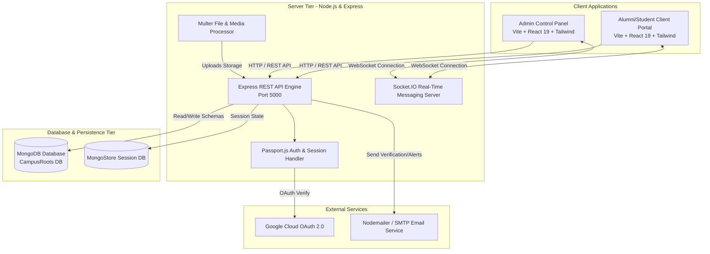

---

## 2. Authentication & Onboarding Workflow

CampusRoots strictly restricts user access to verified CHARUSAT institution members using domain-validated email addresses (`@charusat.edu.in` and `@charusat.ac.in`).

### 2.1 Google OAuth 2.0 Login Workflow
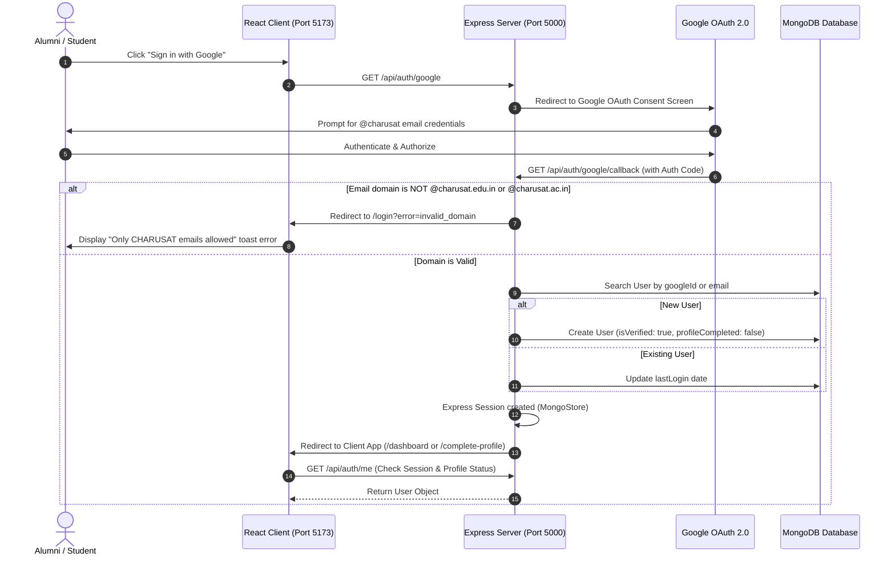

### 2.2 Email OTP Verification Workflow (Alternative Onboarding)
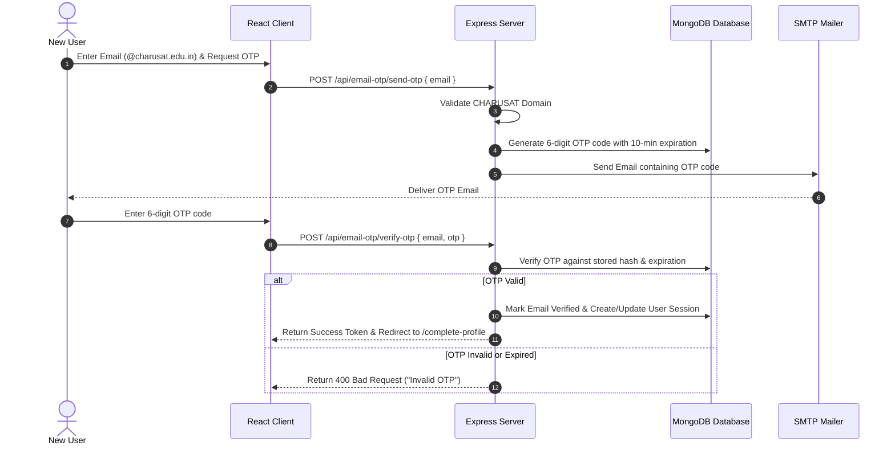

---

## 3. User Profile Setup & Management Workflow

Upon initial login, users with `profileCompleted: false` are forced into the setup flow before accessing the main dashboard.

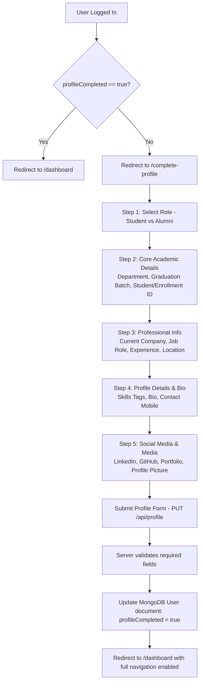

---

## 4. Alumni & Student Networking Workflow

The networking subsystem allows users to search, filter, send, accept, reject, or unfriend connections within the institution.

### 4.1 Search & Filter Flow
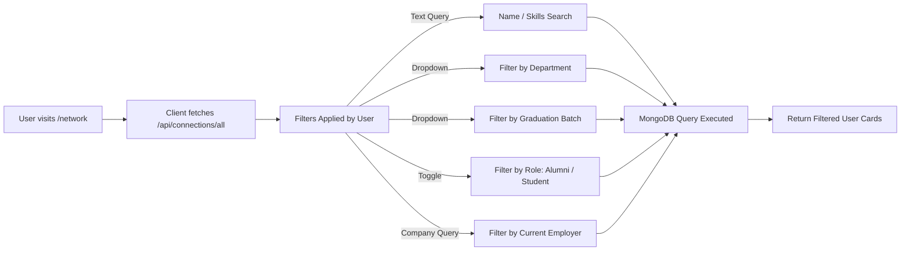

### 4.2 Connection Request Lifecycle
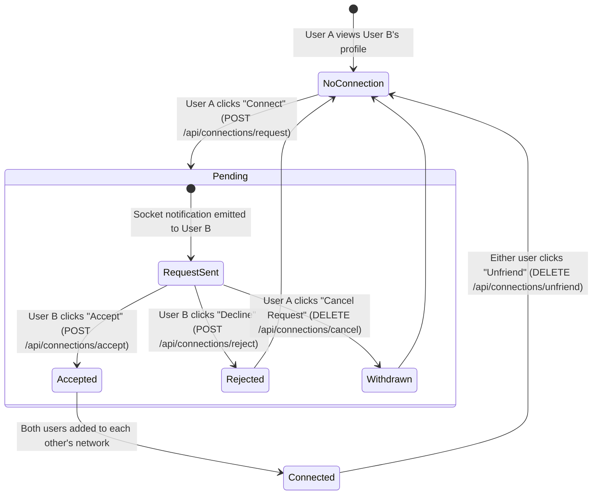

---

## 5. Community Feed & Content Engagement Workflow

The Feed allows alumni and students to share updates, news, job leads, and media images with likes and threaded discussions.

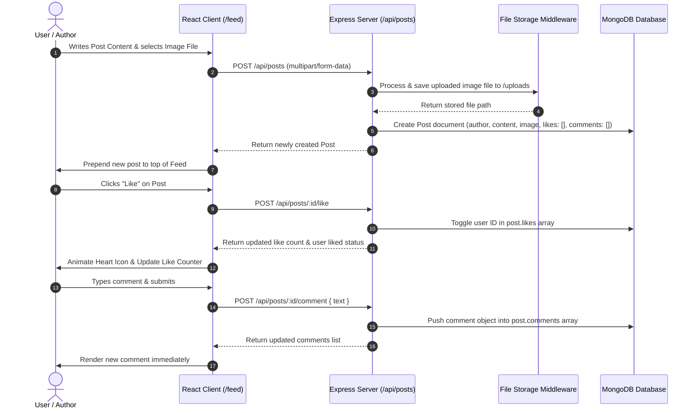

---

## 6. Real-Time Direct & Group Messaging Workflow

CampusRoots features instantaneous 1-on-1 and group chat powered by **Socket.IO** room subscriptions.

### 6.1 Direct Messaging Workflow
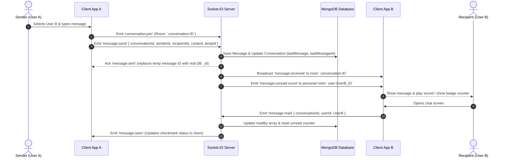

### 6.2 Group Messaging Workflow
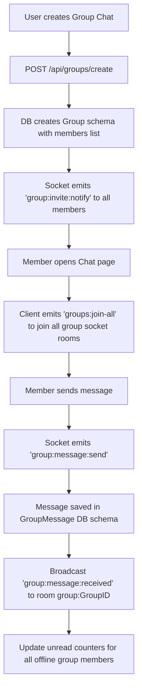

---

## 7. Reunion Event & Gathering Workflow

The Reunion module facilitates batch reunions, department gatherings, and university-wide alumni meets.

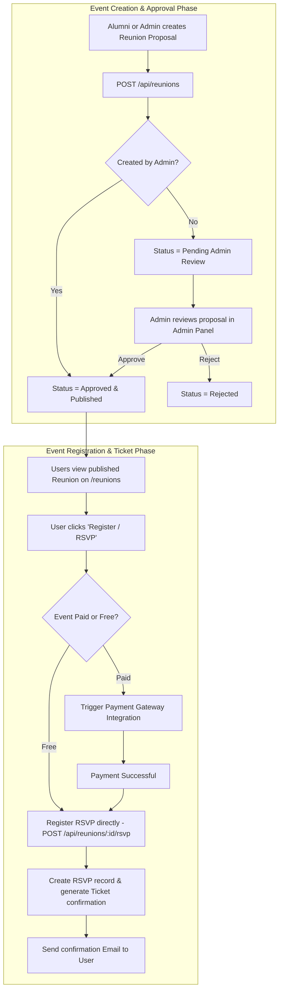

---

## 8. Internship & Placement Portal Workflow

The Internship module allows alumni to post hiring opportunities, job openings, and referral opportunities for current students and junior alumni.

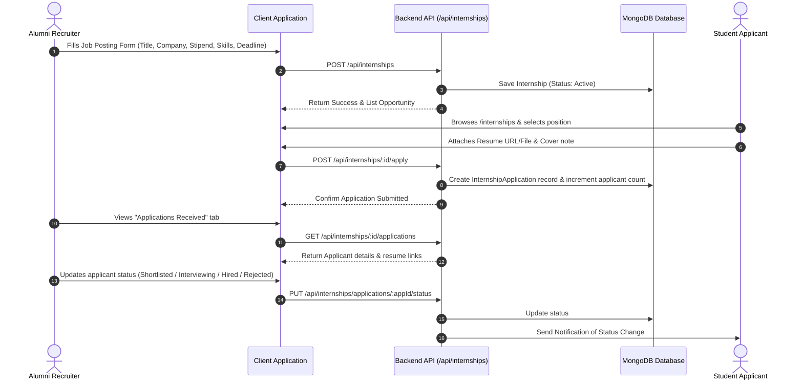

---

## 9. Campus Fundraising & Donation Workflow

Alumni can give back to university initiatives, infrastructure projects, scholarships, and student innovation funds.

```mermaid
flowchart LR
    A[Admin creates Donation Campaign] --> B[Published on /donations]
    B --> C[Alumni views campaign goals & raised amount]
    C --> D[Alumni enters Donation Amount & Message]
    D --> E[Selects Payment Method: UPI / Card / NetBanking]
    E --> F[Executes Transaction]
    F --> G[POST /api/donation/process]
    
    G --> H[MongoDB updates Campaign raisedAmount & donors count]
    H --> I[Record added to Donor Wall & Leaderboard]
    I --> J[Tax Exemption Receipt PDF generated & emailed to Alumni]
```

---

## 10. Gallery & Memory Flashback Workflow

CampusRoots maintains nostalgia through campus memory archives, batch photos, throwback galleries, and event media.

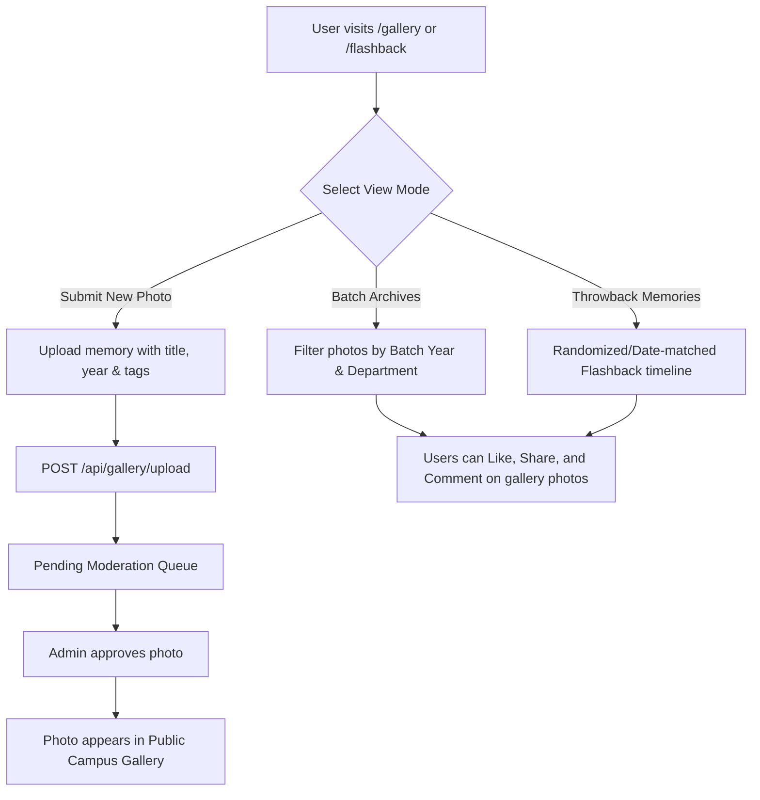

---

## 11. Platform Feedback & Support Workflow

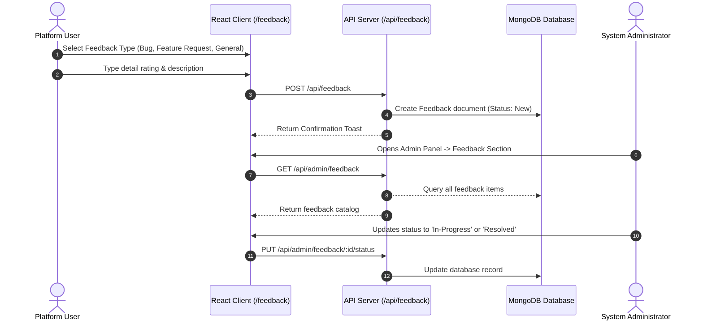

---

## 12. Admin Moderation & Management Workflow

The Admin Panel operates on a dedicated portal (`/admin` app running on port 5174 or 5175) to oversee the entire platform ecosystem.

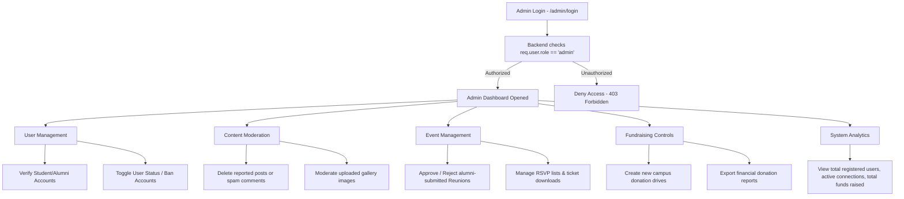

---

## 13. Real-Time Notification Engine Workflow

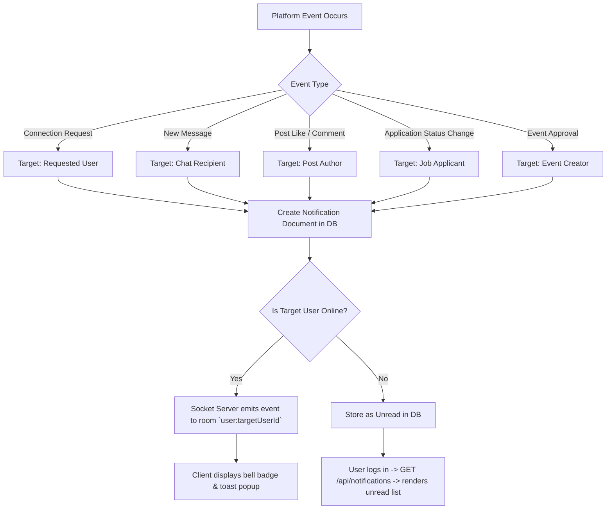

---
*End of Workflow Documentation — CampusRoots Platform*
